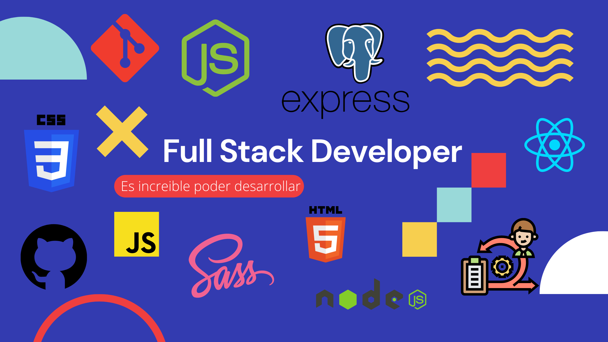

# Hola, Soy Luis! 👋

## 🚀 About Me
¿Quién es Luis Martinez? 😄

Soy un Full Stack Developer, desarrollo mis habilidades con gran destreza ya sea en Front-End o Back-End, aunque mi interes y pasion se encuentran en el Back.

Me considero un desarrollador muy curioso, con gran capacidad de aprendizaje y sobre todo una gran disposición al momento de crear, aprender, innovar y ayudar sobre el crecimiento de la empresa o comunidad.

📝 Aprobé 3 trimestres de Ingeniería Informática, desde entonces he estado estudiando de manera autodidacta y curse el Bootcamp de Henry para reforzar mis conocimientos y desempeñarme como Full Stack Developer.

🤓 Mi experiencia laboral ha sido principalmente en el ámbito académico, desarrollando aplicaciones con librerías y frameworks de JavaScript en el Front-End tecnologías como React-Redux, en el Back-End Node, Express, PostgreSQL entre otras...

Te gustaria hablar conmigo? 😁 ¡Puedes contactarme! 📱

Whatsapp: +57 3214363313 o haz click sobre el enlace https://wa.link/ly6eq9 
GitHub: https://github.com/MrLuis-WebMaster
Email: mr.luiswebmaster@gmail.com

👨‍💻👨‍💻👨‍💻👨‍💻👨‍💻👨‍💻👨‍💻

## 🛠 Skills
* HTML
* CSS
* SCSS
* JavaScript
* React
* Node
* Express
* Sequelize
* PostgreSQL

## Proyectos
👩‍💻 Desarrolle una app de Dogs <a href=https://github.com/MrLuis-WebMaster/PI-Dogs> World Dogs </a>

## 🔗 Links

