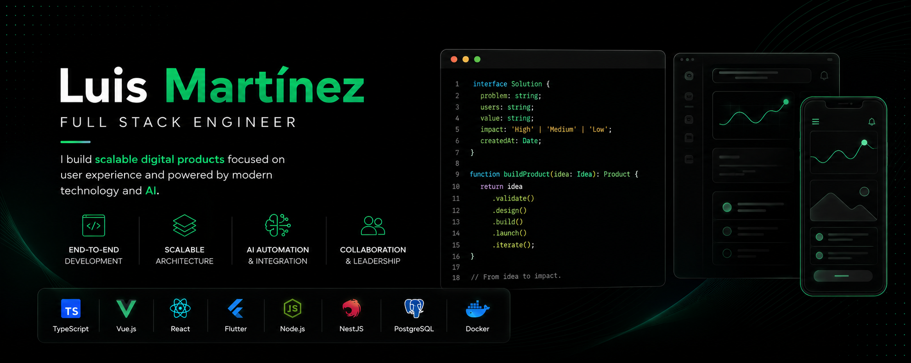

<h1 align="center">Luis Martínez</h1>

  <strong>Full Stack Engineer</strong> 
  SaaS • AI Automation • Product Engineering

  I build scalable digital products from idea to production, working across frontend, backend, mobile and automation.

  
  

---

## About me

I'm a Full Stack Engineer focused on building SaaS products, internal business platforms, mobile experiences and AI-powered automation.

I enjoy working from problem discovery to solution delivery: understanding business needs, planning technical solutions, designing maintainable architectures and building software that can evolve over time.

My work combines product thinking, clean engineering practices and hands-on development across the stack. I care about user experience, code quality, reusable systems and technical decisions that balance scalability, maintainability and business impact.

---

## What I build

- **SaaS Platforms** — product-focused web applications, dashboards, CRMs, ATS platforms and internal tools.
- **AI Automation** — workflows, assistants and automations that improve operations and accelerate product development.
- **Frontend Architecture** — scalable interfaces, reusable components, design systems and responsive experiences.
- **Backend APIs** — REST services, integrations, authentication, data modeling and business logic.
- **Mobile Experiences** — Flutter applications and cross-platform product experiences.
- **Product Engineering** — transforming business problems into clear, maintainable and scalable software solutions.

---

## How I approach software

<table>
  <tr>
    <td width="50%">
      <h3>Product first</h3>
      
I start by understanding the problem, the user and the business context before choosing a technical solution.

    </td>
    <td width="50%">
      <h3>Architecture with purpose</h3>
      
I prefer simple, maintainable architectures that support product evolution without unnecessary complexity.

    </td>
  </tr>
  <tr>
    <td width="50%">
      <h3>Reusable systems</h3>
      
I design components, patterns and APIs that reduce duplication and help teams move faster with consistency.

    </td>
    <td width="50%">
      <h3>Practical engineering</h3>
      
I balance scalability, code quality, performance and delivery speed to create software that works in the real world.

    </td>
  </tr>
</table>

---

## Tech stack

### Core

### Frontend & UI

### Backend, data & tools

---

## Current focus

- Product engineering for SaaS and internal platforms.
- AI-powered automation and developer workflows.
- Scalable frontend architecture with Vue, React and TypeScript.
- Backend APIs and integrations with Node.js and NestJS.
- Flutter mobile experiences.

---

  <strong>Building scalable digital products with product thinking, clean architecture and practical engineering.</strong>

